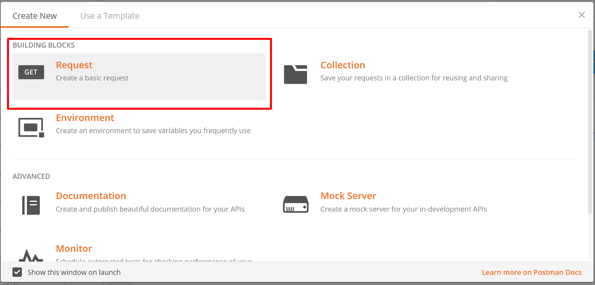
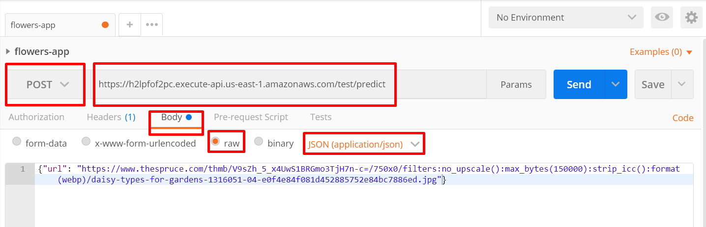
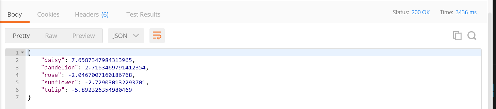

# Flower Images Classification using Deep Learning

Each kind of flowers are having their own distinctive features which distinguish them with other species. Those features such as colors, sepals, petals, stamens (anther and filament), and carpels (stigma, style, ovary). Images from five kinds of flowers are provided in training and test dataset, there are daisy, sunflower, dandelion, rose, and tulip. With Convolutional Neural Network, we can build an image classification model to classify an image flower to one of these flower species.

If you don't want to apply the full repo, you can test the URL which I already deployed with AWS Lambda. These are the steps:

1. You can try with open-source app client such as Insomnia or Postman (Postman as Chrome Extension can be downloaded [here](https://chrome.google.com/webstore/detail/postman/fhbjgbiflinjbdggehcddcbncdddomop/related))

2. Create request in Postman



3. Change the Request method from `GET` to `POST` and fill the URL with https://h2lpfof2pc.execute-api.us-east-1.amazonaws.com/test/predict . For the input, choose **body** -> **raw** -> **JSON (application/json)**, then fill the box with json input.

```{"url": "https://www.thespruce.com/thmb/V9sZh_5_x4UwS1BRGmo3TjH7n-c=/750x0/filters:no_upscale():max_bytes(150000):strip_icc():format(webp)/daisy-types-for-gardens-1316051-04-e0f4e84f081d452885752e84bc7886ed.jpg"}```



4. Click **Send** and obtain below result.



Dataset source: Kaggle https://www.kaggle.com/datasets/alxmamaev/flowers-recognition

## How to Use this Repo?
1. Clone this repo to your local with command `git clone`
2. This analysis performed using `Ubuntu 22.04` and `Python 3.9.13`. The training and hyperparameter tuning was ran with the help of Jupyter Notebook in Saturn Cloud, because it would be faster using GPU. The tutorial to set up Saturn Cloud can be followed with this [video](https://www.youtube.com/watch?v=WZCjsyV8hZE&list=PL3MmuxUbc_hIhxl5Ji8t4O6lPAOpHaCLR&index=76).
3. Before running this analysis on your machine, install the right version of packages in `requirements.txt` with this syntax: `pip install -r requirements.txt`.
4. EDA, training and tuning the hyperparameter syntax is provided in `flowers_classification.ipynb`. 
5. Deployment steps provided below. 

## Deployment in Local
1. Convert tensorflow model (`model_xception.h5`) to tflite model, so we could have smaller docker image size. The syntax for conversion can be seen in `tf-model.ipynb`. The result of the conversion, or the tflite model is `flowers_model.tflite`.
2. Function for predicting has been created in `lambda_function.py`, basically it loads the tflite model, obtain the output for image classification, and lambda handler for serverless (cloud) deployment.
3. Open Docker Desktop. Using Dockerfile that's been cloned, we can build the Docker Images `docker build -t flowers2-model .`
4. Without closing the Docker Desktop, run the Docker Images with specific port `docker run -it --rm -p 8080:8080 flowers2-model:latest`
   In my case, port 8080 in my computer has been taken by other apps so it gave me this error:
   
   
   
   So the command changed to `docker run -it --rm -p 3000:8080 flowers2-model:latest`, it'll map the port 3000 on the host to 8080 in the container.
   
   
5. Doing the test with `test.py`. There are two deployment URL in this file, make sure you use the first one for **local deployment**, remove the hash tag #.


If it's success, it'd obtain this result.


## Deployment in Cloud (AWS Lambda)
1. After building Docker image such as the steps above, we're gonna put the docker image in Amazon EC2 Container Registry (ECR). First, create the repository with AWS CLI (install it if you don't have with `pip install awscli`)

Command for create AWS ECR repo:
```aws ecr create-repository --repository-name flowers-tflite-images```

2. You can see the new repo in AWS ECR console, click the repo and it will show this page, click View Push Commands (the commands to push docker images to ECR repo). Run those commands except the second one, building docker image, which we had done before. 


Be careful in number 3 the command is:

```docker tag <image_name_in_your_local_desktop>:latest <repo_URI>/<repo_name_in_ECR>:latest```

After this finished, we will get our docker images in ECR repo.

3. Go to AWS Lambda console. Select **Create Function**, give the lambda function a name and browse the pushed image. Then, create the test event.

```{"url": "https://www.thespruce.com/thmb/V9sZh_5_x4UwS1BRGmo3TjH7n-c=/750x0/filters:no_upscale():max_bytes(150000):strip_icc():format(webp)/daisy-types-for-gardens-1316051-04-e0f4e84f081d452885752e84bc7886ed.jpg"}```

For further tutorial [video](https://www.youtube.com/watch?v=kBch5oD5BkY&list=PL3MmuxUbc_hIhxl5Ji8t4O6lPAOpHaCLR&index=94).

4. To create API Gateway, we go to API Gateway service in AWS and create new API. Create `/predict` resource and add `POST` method.
Further tutorial can be seen [here](https://www.youtube.com/watch?v=wyZ9aqQOXvs&list=PL3MmuxUbc_hIhxl5Ji8t4O6lPAOpHaCLR&index=95).

5. Deploy the API and we can get Invoke URL. This is my current Invoke URL https://h2lpfof2pc.execute-api.us-east-1.amazonaws.com/test

6. Test the API Gateway with `test.py`. Unlike Deployment in Local above, make sure you use the second URL for **cloud deployment**, remove the hash tag #. 

The URL for testing the API is https://h2lpfof2pc.execute-api.us-east-1.amazonaws.com/test/predict (don't forget to add **/predict**).
If it's success, it'd obtain this result below.


